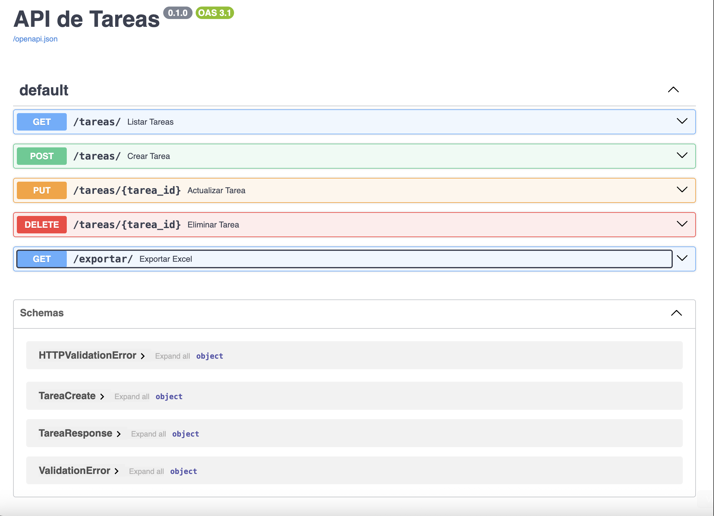
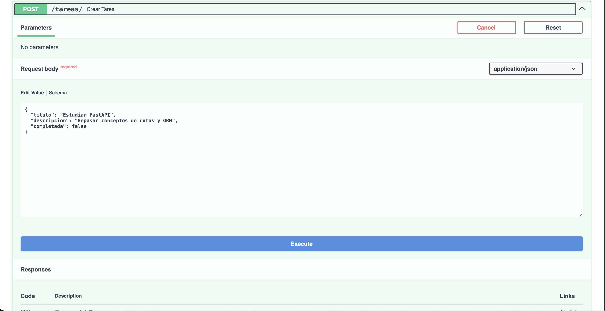
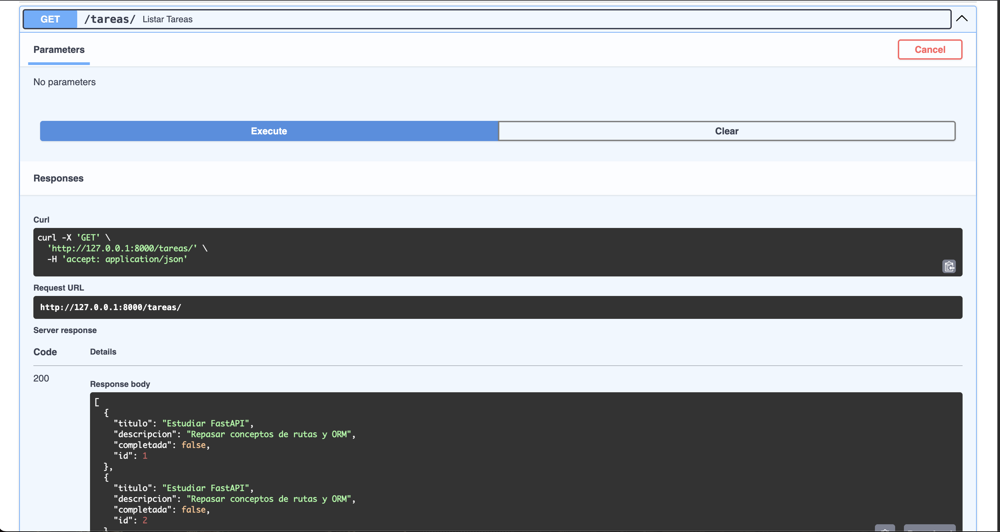
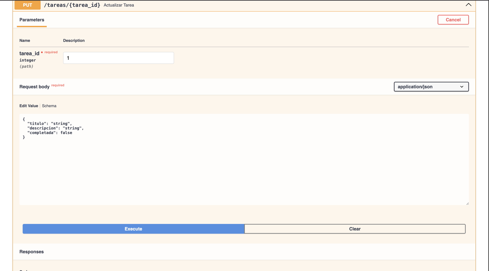
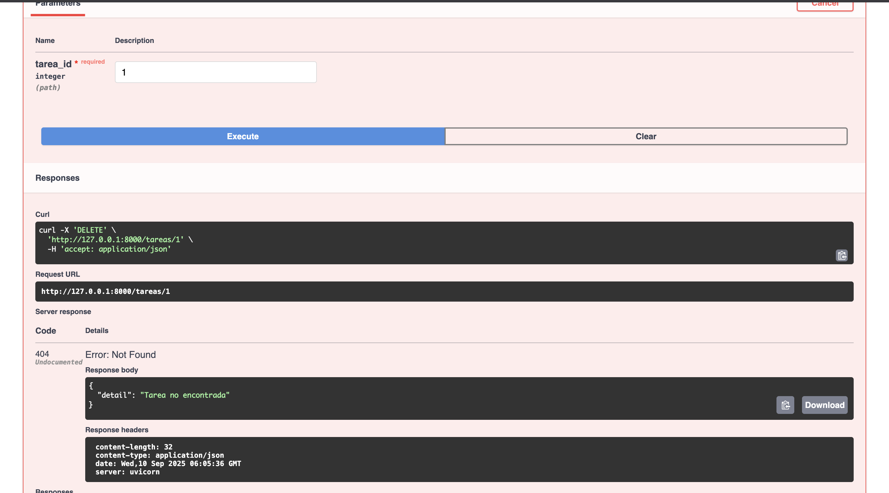

# ✅ API de Tareas con FastAPI

API RESTful para gestionar una lista de tareas (To-Do List).  
Permite **crear, listar, actualizar, eliminar y exportar tareas a Excel**.

---

## 🚀 Funcionalidades
- CRUD de tareas (crear, leer, actualizar, eliminar).
- Cada tarea tiene título, descripción y estado (pendiente/completada).
- Exportación de tareas a Excel.
- Documentación automática en `/docs`.

---

## ▶️ Cómo correrlo
1. Clonar el repositorio:
   ```bash
   git clone https://github.com/krisspaz/todo_api_fastapi.git
   cd todo_api_fastapi
INSTALAR DEPENDENCIAS
pip install -r requirements.txt 
pip3 install -r requirements.txt
EJECUTAR EL SERVIDOR
uvicorn main:app --reload

## 📸 Capturas ### Swagger UI  
### Crear tarea 
### Listar tareas  
### Actualizar tarea  
### Eliminar tarea   
### Exportación a Excel 