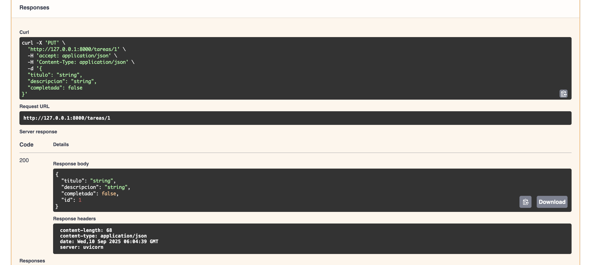

# ✅ API de Tareas con FastAPI

API RESTful para gestionar una lista de tareas (To-Do List).  
Permite crear, listar, actualizar, eliminar y exportar tareas a Excel.

---

## 🚀 Funcionalidades
- CRUD de tareas (crear, leer, actualizar, eliminar).
- Cada tarea tiene título, descripción y estado (pendiente/completada).
- Exportación de tareas a Excel.
- Documentación automática en `/docs`.

---

## ▶️ Cómo correrlo
1. Instalar dependencias:
   ```bash
   pip install -r requirements.txt

## 📸 Capturas

### Swagger UI


### Crear tarea


### Listar tareas


### Actualizar tarea


### Eliminar tarea



### Exportación a Excel

